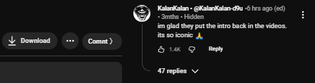

# YouTube-comment-Stats

download the 7z file from release, extract it.
chromium browsers: extensions > turn ON dev mode > load unpacked > refresh :)

username • handle • comment_time (edited?) • account_age • subs_count

Sample  

Button (v2)  

TODO:
V3? dislike count??
